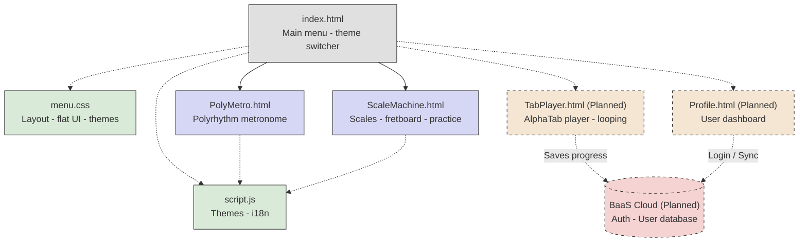

# JS-musicalHelper (jojozelan Tools)

## About the Project
**JS-musicalHelper** is a web-based, multi-tool platform designed to assist musicians in the production, study, and creation of music. The fundamental concept of this website is to consolidate various musical utilities into a single, cohesive, and interactive environment.

Whether you are practicing complex rhythms, studying music theory, or mapping out scales on a fretboard, this platform provides the necessary visual and audio tools to enhance your musical workflow.

The application is built using **vanilla HTML, CSS, and JavaScript**, making it lightweight and easy to run directly in any modern web browser without the need for complex backend setups or installations.

---

## Project Architecture & Roadmap



---

## Features and Modules

### 1. Main Menu (Hub)
Central hub connecting all tools with theme selection and language toggle.

### 2. Polyrhythm Metronome
Visual + audio tool for practicing polyrhythms using SVG and Web Audio API.

### 3. Scale Machine
Interactive fretboard with scales, tunings, and theory integration.

### 4. Practice Mode
Mini-games for theory and ear training.

### 5. CHUG Button
Low-tuned palm-mute trigger for metal practice.

---

## Directory Structure

```
JS-musicalHelper/
├── index.html
├── src/
│   ├── index.html
│   ├── PolyMetro.html
│   └── ScaleMachine.html
├── css/
│   ├── menu.css
│   ├── metronome.css
│   └── scale.css
├── js/
│   ├── script.js
│   ├── metronome.js
│   └── scale.js
└── pic ideas/
```

---

## How to Run

1. Clone the repository:
   git clone https://github.com/your-username/JS-musicalHelper.git

2. Open index.html in your browser.
